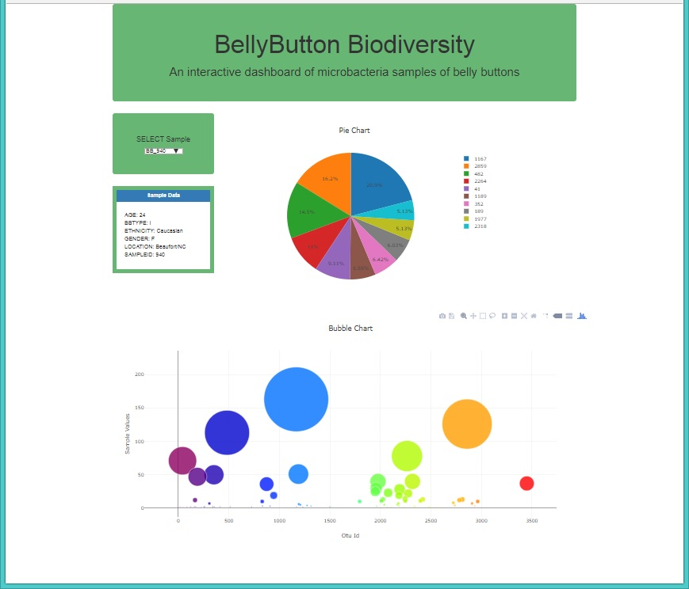

#BellyButton Biodiversity

An interactive dashboard to explore the [Rob Dunn Lab DataSet](http://robdunnlab.com/projects/belly-button-biodiversity/).

Try it on [Heroku.](https://dashboard-b-b-biodiversity.herokuapp.com/)

Technology stack used: Flask, Sqlite, SQLAlchemy, Pandas, JavaScript library Plotly, and HTML/CSS/Bootstrap.

